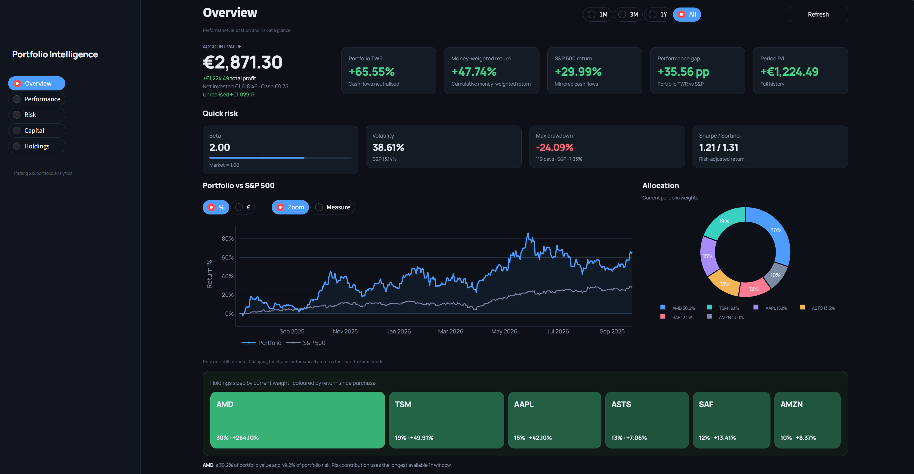

# Trading 212 Portfolio Tracker

A Python + Streamlit dashboard that connects to the Trading 212 API and answers a question a headline return alone cannot: *is this actually a good return, or does it just look like one?*

It reconstructs portfolio history day by day, separates investment performance from the timing of my own deposits and withdrawals, benchmarks against a cash-flow-matched S&P 500, and breaks risk down to the individual holding.



Built by **Kian Magrone**, final-year **TU905 Economics & Finance** student at **TU Dublin** — with AI assistance (see [How I Used AI](#how-i-used-ai)).

---

## Why I built this

The headline return figure in Trading 212 was not answering the question I actually cared about.

I'd invested a larger amount earlier on, made returns while that capital was in the market, then withdrew a significant chunk of it. Once the remaining net invested capital was much smaller, a simple return calculation could flatter the portfolio — making it look better than the return I'd actually experienced.

So I built something that separates three different things:

- how the investments themselves performed, independent of my cash movements
- how the *timing* of my deposits and withdrawals affected my actual result
- how that same capital would have done against a market benchmark

That's why the dashboard reports **time-weighted return (TWR)** and **money-weighted return (MWR)** as two separate numbers, alongside a benchmark comparison — and from there it grew into a full performance and risk analyser.

---

## Features

**Overview** — account value, TWR, MWR, S&P 500 comparison and outperformance, current allocation, and a quick risk summary at a glance.

**Performance** — rolling 1M / 3M / 1Y / full-history returns, start and end values per period, external cash flows, benchmark returns, best/worst day, and risk-adjusted performance stats.

**Risk** — volatility, beta, correlation, Sharpe, Sortino, max drawdown (with duration), historical VaR, rolling beta/volatility, and holding-level risk contribution.

**Capital** — net invested capital and portfolio profit tracked separately through time, so cash movements never get mistaken for performance.

**Holdings** — allocation, per-holding return, beta and risk contribution, plus a hypothetical backtest of today's weights over past periods.

---

## Methodology

<details>
<summary><strong>Time-weighted return (TWR)</strong> — how did the investments perform, independent of my cash flows?</summary>

The app reconstructs portfolio value day by day and strips out external cash flows before calculating each day's return:

```
daily return = (ending value − external cash flow) / previous value − 1
```

A deposit is removed from the return rather than counted as profit; a withdrawal is handled the same way in reverse. Trades *within* the account (selling one stock to buy another) aren't external cash flows, so they don't affect this.

Daily returns are then linked geometrically:

```
TWR = (1 + r₁) × (1 + r₂) × ... × (1 + rₙ) − 1
```

</details>

<details>
<summary><strong>Money-weighted return (MWR)</strong> — what return did my actual money experience, given when I moved it?</summary>

Uses an **XIRR-style calculation** on the actual dates of my deposits and withdrawals: the opening value is the initial investment, deposits are additional investment, withdrawals are money returned, and the closing value is the final value. XIRR solves for the rate `r` that zeroes out the discounted cash flows:

```
Σ [ cash_flow_i / (1 + r)^(days_i / 365) ] = 0
```

Because it uses real dates, two identical deposits at different points in the year don't affect the result equally. For dashboard periods (1M/3M/1Y), the annualised XIRR is converted back to the cumulative return over that exact window so it's comparable to TWR. With no external cash flows in a period, MWR reduces to the ordinary start-to-end return and should therefore be very close to TWR.

**Fallback:** where XIRR has no clean solution, the app falls back to **Modified Dietz**, which weights each cash flow by how long it was invested during the period:

```
return = (ending − starting − net flows) / (starting + Σ weighted flows)
weight = days remaining after the flow / total days in period
```

</details>

<details>
<summary><strong>S&P 500 benchmark</strong> — cash-flow matched, not just a side-by-side percentage</summary>

Historical S&P 500 data comes from Yahoo Finance via `yfinance`. The app builds a *synthetic* benchmark portfolio: whenever capital moves in or out of my real portfolio, the same EUR flow is applied to the benchmark on the same date. So the benchmark isn't just "the S&P 500's return" — it's what a comparable S&P 500 investment would have done with my exact deposit/withdrawal pattern.

</details>

<details>
<summary><strong>Beta and correlation</strong></summary>

Calculated from paired daily returns within the selected period:

```
beta = covariance(portfolio returns, S&P returns) / variance(S&P returns)
```

`1.0` ≈ similar sensitivity to the market, `>1.0` ≈ greater sensitivity, `<1.0` ≈ lower sensitivity. Correlation is reported separately since it captures direction-of-movement agreement, not relative size — a portfolio can be highly correlated with the market but still have a beta well above or below 1. Rolling beta (30/90-observation windows) shows whether market sensitivity has changed over time.

</details>

<details>
<summary><strong>Volatility, Sharpe, Sortino</strong></summary>

Volatility is the standard deviation of daily returns, annualised:

```
annualised volatility = daily return std dev × √252
```

**Sharpe** compares average return with total volatility; **Sortino** is similar but only penalises downside variation, so positive volatility is not treated the same way as losses.

</details>

<details>
<summary><strong>Max drawdown and Value at Risk</strong></summary>

Drawdown compares each day's value to the highest value reached so far:

```
drawdown = current value / previous peak − 1
```

The largest fall is the max drawdown; the app also tracks how long the portfolio stayed below its previous peak. **95% daily VaR** uses the actual historical return distribution (not an assumed statistical shape) to estimate a loss threshold exceeded by roughly the worst 5% of days, shown in both % and €.

</details>

<details>
<summary><strong>Beta and risk contribution by holding</strong></summary>

**Beta contribution** is simply `holding weight × holding beta` — so a large position isn't automatically the biggest driver of market sensitivity; its own beta matters too.

**Risk contribution** uses the covariance matrix of holding returns. With weights `w` and covariance matrix `Σ`, portfolio variance is `w′Σw`, and each holding's share is:

```
risk contribution_i = wᵢ × (Σw)ᵢ / portfolio variance
```

This is why a position can be a small % of the portfolio by value but a large % of its risk.

</details>

**Data flow:**

```
Trading 212 account data + Yahoo Finance prices/FX
        ↓
Historical portfolio reconstruction
        ↓
Performance + risk calculations
        ↓
Streamlit / Plotly dashboard
```

---

## Tech stack

| | |
|---|---|
| **Python 3.14** | Application and analytics |
| **pandas / NumPy** | Data processing, time series, numerical calculations |
| **Streamlit** | Dashboard application |
| **Plotly** | Interactive charts |
| **yfinance** | Historical market and FX data |
| **requests** | Trading 212 API calls |
| **python-dotenv** | Local API credential loading |

Exact versions are pinned in `requirements.txt`.

## Project structure

| File | Purpose |
|---|---|
| `app.py` | Main Streamlit app — layout, controls, page logic (entry point) |
| `dashboard_charts.py` | Plotly charts and visualisations |
| `trading212.py` | Trading 212 API auth and requests |
| `account_history.py` | Retrieves and prepares historical account activity |
| `market_data.py` | Historical market-price retrieval |
| `market_symbols.py` | Maps Trading 212 instruments to market-data symbols |
| `fx_data.py` | Historical FX data and EUR conversion |
| `history_cache.py` | Local caching for historical data |
| `portfolio_history.py` | Reconstructs holdings and portfolio value through time |
| `capital_history.py` | Tracks deposits, withdrawals, net invested capital |
| `performance_history.py` | Builds the historical return series |
| `performance.py` | Core performance calculations |
| `performance_metrics.py` | Portfolio-level performance summary |
| `return_metrics.py` | Money-weighted / XIRR calculations |
| `risk_metrics.py` | Volatility, beta, correlation, Sharpe, Sortino, drawdown, VaR |
| `period_analytics.py` | Builds Full / 1Y / 3M / 1M analytical windows |
| `current_holdings_analytics.py` | Current-position return and risk analysis |
| `holdings_comparison.py` | Compares current holdings against historical behaviour |

---

## API and data handling

Trading 212 is accessed via authenticated HTTP requests, with credentials kept in a local `.env` file excluded from Git. The dashboard is read-only — it never sends trading instructions. Requests use timeouts and surface HTTP errors rather than swallowing them, and historical data is cached so normal use doesn't repeatedly hit the same endpoints. Yahoo Finance is used separately for market prices and FX.

## Quick start

```bash
git clone <repository-url>
cd portfolio-intelligence
pip install -r requirements.txt
```

Create a `.env` file in the project root:

```
TRADING212_API_KEY=your_key_here
TRADING212_API_SECRET=your_secret_here
```

Then run:

```bash
streamlit run app.py
```

Built around my own Trading 212 account — using it with a different account may need extra symbol mappings for instruments Yahoo Finance names differently.

---

## How I used AI

I worked through this step by step with ChatGPT rather than handing it the whole spec at once, because I wanted to understand what was being built and be able to challenge the output when it didn't make sense. That meant:

- deciding what each metric should measure and why — including why TWR and MWR needed to be shown separately, not blended into one number
- checking calculations against figures I could verify by hand from my own account
- catching and fixing issues introduced during development, including incorrect period boundaries and chart/date inconsistencies
- using Claude separately to work through a cleaner dashboard design, then feeding that back to ChatGPT to implement

AI made the build much faster. The part that actually taught me something was learning to specify a calculation precisely, check the result, and recognise when the answer was wrong.

## What I learned

- Turning a personal finance problem into a structured software project
- Practical Python development in VS Code, and Git/GitHub version control
- Working with REST APIs, historical market data, and multi-currency data
- Why TWR and MWR answer different questions — and why the gap between them can be large
- How much benchmark methodology can change the conclusion of a comparison
- How covariance, beta, volatility and drawdown fit together in portfolio risk
- Directing AI productively while still validating its output myself

## Known limitations

- **Instrument mapping:** Trading 212 codes don't always map cleanly to Yahoo Finance tickers; I maintain aliases for the ones that need it.
- **Full liquidation and re-entry:** reconstruction works well for my history, but fully selling out and later rebuilding a portfolio creates edge cases that need more testing before this generalises to other accounts.
- **Local cache:** designed around single-account use — clear it before pointing the app at a different Trading 212 account.
- **Broker vs. reconstructed values:** small differences can appear versus Trading 212's own live prices and FX/valuation timing.
- **Current-holdings backtest** deliberately holds today's weights constant through a past period — it's a hypothetical comparison, not what I actually owned at the time.

## Roadmap

- [ ] AI-assisted ticker mapping — an agent that detects a failed instrument mapping, finds the likely Yahoo Finance symbol, tests it, and proposes the fix
- [ ] Portfolio assistant / chatbot that answers questions about the data directly (*"how has my beta changed over the last 3 months?"*)
- [ ] Sector and geographic exposure breakdowns
- [ ] Automated weekly/monthly performance and risk reports

---

## Disclaimer

Personal project for my own portfolio analysis — not financial advice. Screenshot figures are from my own account and will naturally move with the market.
