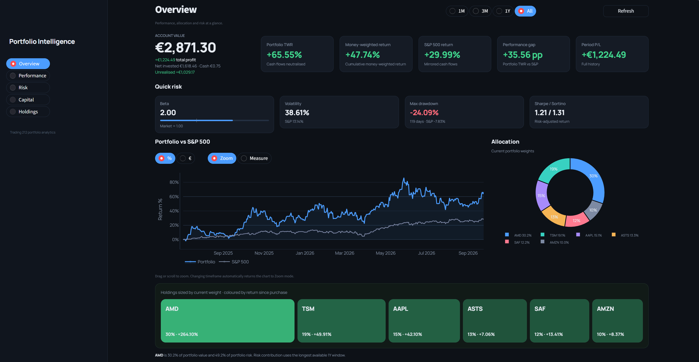

# Trading 212 Portfolio Tracker

This is a personal portfolio analytics dashboard I built in Python and Streamlit around my Trading 212 account.

It pulls account data from the Trading 212 API, reconstructs the portfolio historically, and turns it into something much more useful than the basic figures shown in the broker app. It tracks performance over time, separates investment returns from deposits and withdrawals, compares the portfolio against a cash-flow-matched S&P 500 benchmark, and breaks down risk across the portfolio and individual holdings.

I originally started it because I wanted a better answer to a fairly simple question: how well was my portfolio actually doing? From there it gradually turned into a much bigger project covering money-weighted returns, time-weighted returns, XIRR, benchmark performance, portfolio risk, historical reconstruction, and current-holdings analysis.

**[Live Dashboard](https://kian-portfolio-dashboard.streamlit.app)**



Built by **Kian Magrone**, final-year **TU905 Economics & Finance** student at **TU Dublin** — with AI assistance (see [How I Used AI](#how-i-used-ai)).

---

## Why I built this

The headline return figure in Trading 212 was not answering the question I actually cared about.

I'd invested a larger amount earlier on, made returns while that capital was in the market, then withdrew a significant chunk of it. Once the remaining net invested capital was much smaller, a simple return calculation could flatter the portfolio — making it look better than the return I'd actually experienced.

So I built something that separates three different things:

- how the investments themselves performed, independent of my cash movements
- how the *timing* of my deposits and withdrawals affected my actual result
- how that same capital would have done against a market benchmark

That's why the dashboard reports **time-weighted return (TWR)** and **money-weighted return (MWR)** as two separate numbers, alongside a benchmark comparison — and from there it grew into a full performance and risk analyser.

---

## Features

**Overview** — account value, total profit, annualised money-weighted return (XIRR), a cash-flow-matched S&P 500 comparison, annualised outperformance, TWR, current allocation, and a quick risk summary at a glance. Shorter periods also show cumulative MWR alongside an annualised XIRR equivalent.

**Performance** — 1M / 3M / 1Y / full-history analysis covering cumulative MWR, annualised XIRR, TWR, start and end values, external cash flows, benchmark returns, best/worst day, and risk-adjusted performance stats.

**Risk** — volatility, beta, correlation, Sharpe, Sortino, max drawdown (with duration), historical VaR, rolling beta/volatility, and holding-level risk views. The holding charts can show either actual portfolio contribution or a weight-adjusted view that separates a holding's own risk/beta from simply being a large position.

**Capital** — net invested capital and portfolio profit tracked separately through time, so cash movements never get mistaken for performance.

**Holdings** — allocation, per-holding return, beta and risk contribution, plus a hypothetical backtest of today's weights over past periods.

**AI-assisted ticker resolution** — if a Trading 212 instrument does not have a known Yahoo Finance mapping, the app searches Yahoo Finance for candidate instruments, uses an OpenAI model to select the most likely equivalent, independently verifies the selected symbol against Yahoo market data and currency, and caches the verified mapping for future use.

---

## Methodology

<details>
<summary><strong>Time-weighted return (TWR)</strong> — how did the investments perform, independent of my cash flows?</summary>

The app reconstructs portfolio value day by day and strips out external cash flows before calculating each day's return:

```
daily return = (ending value − beginning value − external cash flow)
               / (beginning value + weighted external flow)
```

The weighted flow accounts for when an external cash movement happened during the day. A deposit is removed from the return rather than counted as profit; a withdrawal is handled the same way in reverse. Trades *within* the account (selling one stock to buy another) aren't external cash flows, so they don't affect this.

Daily returns are then linked geometrically:

```
TWR = (1 + r₁) × (1 + r₂) × ... × (1 + rₙ) − 1
```

</details>

<details>
<summary><strong>Money-weighted return (MWR)</strong> — what return did my actual money experience, given when I moved it?</summary>

Uses an **XIRR-style calculation** on the actual dates of my deposits and withdrawals: the opening value is the initial investment, deposits are additional investment, withdrawals are money returned, and the closing value is the final value. XIRR solves for the rate `r` that zeroes out the discounted cash flows:

```
Σ [ cash_flow_i / (1 + r)^(days_i / 365) ] = 0
```

Because it uses real dates, two identical deposits at different points in the year don't affect the result equally. For dashboard periods (1M/3M/1Y), the app shows the cumulative money-weighted result for the selected window and its annualised XIRR equivalent. For full history, annualised XIRR is the main money-weighted figure on the overview, while the cumulative MWR equivalent is still shown as context. With no external cash flows in a period, MWR reduces to the ordinary start-to-end return and should therefore be very close to TWR.

**Fallback:** where XIRR has no clean solution, the app falls back to **Modified Dietz**, which weights each cash flow by how long it was invested during the period:

```
return = (ending − starting − net flows) / (starting + Σ weighted flows)
weight = days remaining after the flow / total days in period
```

</details>

<details>
<summary><strong>S&P 500 benchmark</strong> — cash-flow matched, not just a side-by-side percentage</summary>

Historical S&P 500 data comes from Yahoo Finance via `yfinance`. The app builds a *synthetic* benchmark portfolio: whenever capital moves in or out of my real portfolio, the same EUR flow is applied to the benchmark on the same date. So the benchmark isn't just "the S&P 500's return" — it's what a comparable S&P 500 investment would have done with my exact deposit/withdrawal pattern.

</details>

<details>
<summary><strong>Beta and correlation</strong></summary>

Calculated from paired daily returns within the selected period:

```
beta = covariance(portfolio returns, S&P returns) / variance(S&P returns)
```

`1.0` ≈ similar sensitivity to the market, `>1.0` ≈ greater sensitivity, `<1.0` ≈ lower sensitivity. Correlation is reported separately since it captures direction-of-movement agreement, not relative size — a portfolio can be highly correlated with the market but still have a beta well above or below 1. Rolling beta (30/90-observation windows) shows whether market sensitivity has changed over time.

</details>

<details>
<summary><strong>Volatility, Sharpe, Sortino</strong></summary>

Volatility is the standard deviation of daily returns, annualised:

```
annualised volatility = daily return std dev × √252
```

**Sharpe** compares average return with total volatility; **Sortino** is similar but only penalises downside variation, so positive volatility is not treated the same way as losses.

</details>

<details>
<summary><strong>Max drawdown and Value at Risk</strong></summary>

Drawdown compares each day's value to the highest value reached so far:

```
drawdown = current value / previous peak − 1
```

The largest fall is the max drawdown; the app also tracks how long the portfolio stayed below its previous peak. **95% daily VaR** uses the actual historical return distribution (not an assumed statistical shape) to estimate a loss threshold exceeded by roughly the worst 5% of days, shown in both % and €.

</details>

<details>
<summary><strong>Beta and risk contribution by holding</strong></summary>

**Beta contribution** is simply `holding weight × holding beta` — so a large position isn't automatically the biggest driver of market sensitivity; its own beta matters too.

**Risk contribution** uses the covariance matrix of holding returns. With weights `w` and covariance matrix `Σ`, portfolio variance is `w′Σw`, and each holding's share is:

```
risk contribution_i = wᵢ × (Σw)ᵢ / portfolio variance
```

The dashboard keeps this actual contribution view, but also offers a weight-adjusted view. That makes it easier to tell whether a holding is contributing a lot of risk simply because it is a large position, or because it is unusually risky relative to its portfolio weight. The beta view can similarly show the holding's own beta relative to the market rather than only `weight × beta`.

</details>

<details>
<summary><strong>AI-assisted ticker resolution</strong> — how unknown Trading 212 symbols are mapped safely</summary>

Trading 212 instrument codes do not always correspond directly to Yahoo Finance symbols.

The resolver uses the following order:

1. use an existing manually verified mapping when one is available;
2. use a previously verified automatic mapping from the local mapping cache;
3. for an unseen instrument, search Yahoo Finance using the Trading 212 instrument name, short name, ISIN and ticker hint;
4. give the real Yahoo Finance candidates and Trading 212 metadata to an OpenAI model, which is restricted to selecting only from those candidates;
5. independently verify that the selected Yahoo symbol returns price history and that its currency is consistent with the Trading 212 instrument;
6. cache the verified mapping for future use.

If the model cannot select a suitable candidate, or the selected symbol fails verification, the resolver raises an error rather than silently using an unverified ticker.

</details>

**Data flow:**

```
Trading 212 account data
        +
known / AI-assisted symbol resolution
        +
Yahoo Finance prices / FX
        ↓
Historical portfolio reconstruction
        ↓
Performance + risk calculations
        ↓
Streamlit / Plotly dashboard
```

---

## Tech stack

| | |
|---|---|
| **Python 3.14** | Application and analytics |
| **pandas / NumPy** | Data processing, time series, numerical calculations |
| **Streamlit** | Dashboard application |
| **Plotly** | Interactive charts |
| **yfinance** | Historical market data, FX data and instrument search |
| **OpenAI API** | AI-assisted resolution of ambiguous Trading 212 → Yahoo Finance instrument mappings |
| **requests** | Trading 212 API calls |
| **python-dotenv** | Local API credential loading |
| **Git / GitHub** | Version control and deployment workflow |

Exact versions are pinned in `requirements.txt`.

## Project structure

| File | Purpose |
|---|---|
| `app.py` | Main Streamlit app — layout, controls, page logic (entry point) |
| `dashboard_charts.py` | Plotly charts and visualisations |
| `trading212.py` | Trading 212 API auth and requests |
| `account_history.py` | Retrieves and prepares historical account activity |
| `market_data.py` | Historical market-price retrieval and symbol-resolution integration |
| `market_symbols.py` | Manually verified Trading 212 → Yahoo Finance mappings |
| `ticker_resolver.py` | Searches, resolves, verifies and caches previously unseen Trading 212 → Yahoo Finance mappings |
| `fx_data.py` | Historical FX data and EUR conversion |
| `history_cache.py` | Local caching for historical data |
| `portfolio_history.py` | Reconstructs holdings and portfolio value through time |
| `capital_history.py` | Tracks deposits, withdrawals, net invested capital |
| `performance_history.py` | Builds the historical return series |
| `performance.py` | Core performance calculations |
| `performance_metrics.py` | Portfolio-level performance summary |
| `return_metrics.py` | Money-weighted / XIRR calculations |
| `risk_metrics.py` | Volatility, beta, correlation, Sharpe, Sortino, drawdown, VaR |
| `period_analytics.py` | Builds Full / 1Y / 3M / 1M analytical windows |
| `current_holdings_analytics.py` | Current-position return and risk analysis |
| `holdings_comparison.py` | Compares current holdings against historical behaviour |

---

## API and data handling

Trading 212 is accessed through authenticated HTTP requests. The dashboard is read-only — it never sends trading instructions. Yahoo Finance is used separately for historical prices, FX data and candidate instrument search.

Known Trading 212 → Yahoo Finance mappings are handled deterministically. When an unseen instrument is encountered, the AI-assisted resolver searches Yahoo Finance first and passes only real candidate instruments to the OpenAI model. The selected symbol is then checked independently against Yahoo price history and currency metadata before it is accepted.

Automatically resolved mappings are cached so the OpenAI API is not normally called again for the same instrument while that cache persists.

Historical Trading 212 activity is cached separately per account. Public market-price and FX caches are shared, but their date coverage is checked before reuse so a short-history cache cannot silently truncate a longer account history. Historical order quantities are also normalised for stock splits before they are matched with Yahoo historical prices.

For local development, credentials are loaded from a `.env` file that is excluded from Git. The deployed Streamlit application uses Streamlit Secrets instead. API keys are never stored in the repository.

## Quick start

```bash
git clone <repository-url>
cd portfolio-intelligence
pip install -r requirements.txt
```

Create a `.env` file in the project root:

```env
TRADING212_API_KEY=your_key_here
TRADING212_API_SECRET=your_secret_here
TRADING212_BASE_URL=https://live.trading212.com/api/v0
OPENAI_API_KEY=your_key_here
```

Then run:

```bash
streamlit run app.py
```

The project was originally built and validated around my own Trading 212 account. AI-assisted ticker resolution removes the need to manually add every unfamiliar Yahoo Finance symbol, and historical account caches are now separated by account while public market/FX data can be safely reused across accounts when the required date range is already cached.

---

## How I used AI

I worked through this project step by step with ChatGPT rather than handing it the whole specification at once, because I wanted to understand what was being built and be able to challenge the output when it didn't make sense.

That meant:

- deciding what each metric should measure and why — including why TWR and MWR needed to be shown separately, not blended into one number;
- checking calculations against figures I could verify by hand from my own account;
- catching and fixing issues introduced during development, including incorrect period boundaries and chart/date inconsistencies;
- using Claude separately to work through a cleaner dashboard design, then feeding that back to ChatGPT to implement;
- designing and testing an AI-assisted ticker resolver where the model is constrained to real Yahoo Finance candidates and its selection is independently validated before use.

AI made the build much faster. The part that actually taught me something was learning to specify a calculation or system precisely, inspect the result and challenge it when the output did not make sense.

## What I learned

- Turning a personal finance problem into a structured software project
- Practical Python development in VS Code, and Git/GitHub version control
- Working with REST APIs, historical market data, and multi-currency data
- Why TWR and MWR answer different questions — and why the gap between them can be large
- How much benchmark methodology can change the conclusion of a comparison
- How covariance, beta, volatility and drawdown fit together in portfolio risk
- Integrating an LLM API as a constrained fallback rather than blindly trusting generated output
- Combining external search results, model selection, programmatic validation and caching in one data pipeline
- Directing AI productively while still validating its output myself

## Known limitations

- **Ticker resolution:** known mappings are deterministic, while unseen instruments can fall back to AI-assisted Yahoo Finance resolution. Unusual listings, share classes or incomplete external metadata can still create edge cases even though candidate symbols are verified before use.
- **AI mapping cache:** automatically resolved ticker mappings are cached locally. On ephemeral cloud infrastructure such as Streamlit Community Cloud, the cache may be lost when the application environment is recreated, causing an instrument to be resolved again.
- **Full liquidation and re-entry:** reconstruction works well for my history, but fully selling out and later rebuilding a portfolio creates edge cases that need more testing before this generalises to other accounts.
- **Broker vs. reconstructed values:** small differences can appear versus Trading 212's own live prices and FX/valuation timing.
- **Current-holdings backtest:** deliberately holds today's weights constant through a past period — it's a hypothetical comparison, not what I actually owned at the time.

## Roadmap

- [x] AI-assisted ticker mapping — search Yahoo Finance candidates, select the likely equivalent with an OpenAI model, verify the result and cache the mapping
- [ ] Portfolio assistant / chatbot that answers questions about the data directly (*"how has my beta changed over the last 3 months?"*)
- [ ] Sector and geographic exposure breakdowns
- [ ] Automated weekly/monthly performance and risk reports

---

## Disclaimer

Personal project for my own portfolio analysis — not financial advice. Screenshot figures are from my own account and will naturally move with the market.
